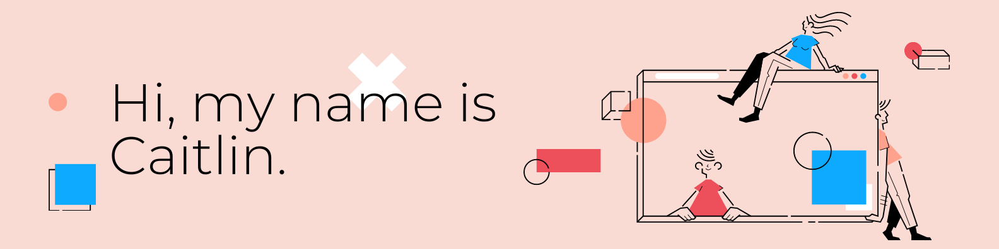

<!-- **caitlingbailey/caitlingbailey** is a ✨ _special_ ✨ repository because its `README.md` (this file) appears on your GitHub profile. -->

### Hi, I'm Caitlin! 👋

I'm a Full-Stack Software Engineer, who loves the world of tech and programming. I mainly use Python, React and C. Thanks for checking out my profile!

🌱 I’m currently learning React

📫 How to reach me: [my website](http://www.caitlingbailey.com)

<!--

Here are some ideas to get you started:

- 🔭 I’m currently working on ...
- 🌱 I’m currently learning ...
- 👯 I’m looking to collaborate on ...
- 🤔 I’m looking for help with ...
- 💬 Ask me about ...
- 📫 How to reach me: ...
- 😄 Pronouns: ...
- ⚡ Fun fact: ...
-->
